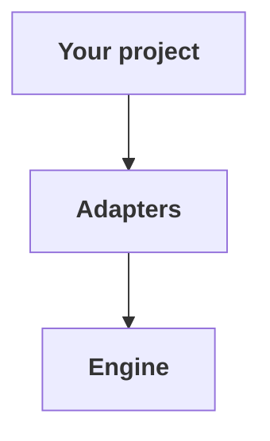
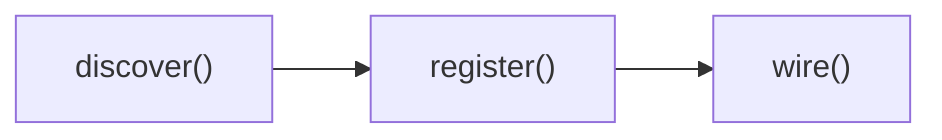

# Architecture

simple-cdk is split into three layers. Your code only ever touches the top two.



- **Your project**: `simple-cdk.config.ts`, your `backend/` folders, and any custom adapters.
- **Adapters**: built-ins (`lambda`, `dynamodb`, `appsync`, `cognito`) plus any you write.
- **Engine** (`@simple-cdk/core`, never changes): runs `discover → register → wire → synth`.

## The engine

The engine is a few hundred lines. It knows nothing about Lambda, DynamoDB, or any specific AWS service. Its job:

1. Resolve your config (which stage, which region, which adapters)
2. Run the lifecycle in order
3. Hand each adapter a typed context

You won't usually touch the engine directly. The CLI does.

## The lifecycle

For each `simple-cdk synth | deploy | diff` run:



- **discover()**: scan the filesystem and return a list of `Resource` objects.
- **register()**: create CDK constructs from those resources.
- **wire()**: cross-reference resources from other adapters.

- **discover**: find what the adapter is responsible for (handler files, model files, trigger folders). Pure read.
- **register**: instantiate CDK constructs (`new NodejsFunction()`, `new dynamodb.Table()`, etc.). One stack per logical group.
- **wire**: connect to other adapters' resources (e.g., AppSync looks up Lambda functions registered by the lambda adapter).

All three phases are optional. An adapter that only adds a CLI command implements none of them.

## The adapter contract

```ts
interface Adapter {
  name: string;
  discover?(ctx: DiscoveryContext): Promise<Resource[]> | Resource[];
  register?(ctx: RegisterContext): void | Promise<void>;
  wire?(ctx: WireContext): void | Promise<void>;
  commands?(): Command[];
}
```

That's the whole API surface. Anything that satisfies this is a valid adapter.

### Resources

A `Resource` is whatever an adapter wants to remember between phases:

```ts
interface Resource<TConfig = unknown> {
  type: string;
  name: string;
  source: string;
  config: TConfig;
}
```

Adapters define their own `TConfig`. The engine treats it as opaque and just shuttles resources between phases.

### Contexts

Each phase gets a context that exposes only what's safe at that point:

| Phase | Has access to |
|-------|---------------|
| `discover` | `rootDir`, `config` (stage, region, etc.), `log` |
| `register` | All of the above plus the CDK `App`, the `stack(name)` factory, this adapter's resources, all adapters' resources |
| `wire` | Everything in `register` plus `resourcesOf(adapterName)` for cross-adapter lookup |

## Stacks

Adapters get stacks via `ctx.stack(name)`. The engine creates one CDK stack per logical name, scoped as `<app>-<stage>-<name>`. Two adapters that ask for the same stack name share one stack. That's how the dynamodb and lambda adapters can both put resources into a `data` stack if you want.

Defaults:

| Adapter | Default stack name |
|---------|--------------------|
| `lambda` | `lambda` |
| `dynamodb` | `data` |
| `cognito` | `auth` |
| `appsync` | `api` |
| `rds` | `data` |
| `outputs` | `outputs` |

Override via the adapter's `stackName` option, or per-resource via the resource's own `stack` field where supported.

### Pinning a stack's logical ID

`ctx.stack(name, opts?)` takes an optional `StackOptions` with an `id` field. When set, the engine uses that id verbatim instead of the default `<app>-<stage>-<name>` prefix. Adapters that expose this option surface it as `stackId`:

```ts
rdsAdapter({ engine: 'postgres', stackId: 'legacy-db-stack' });
outputsAdapter({ collect, stackId: 'MyExistingOutputsStack' });
```

Use this when adopting simple-cdk over an existing CloudFormation stack whose name doesn't follow the default shape, or when grouping resources from multiple adapters into one stack whose id you want to control.

### Pinning a construct's logical ID

Stack-level `stackId` covers the outer shell. For the primary construct inside each adapter, use a construct-level override:

| Adapter | Option | Default |
|---------|--------|---------|
| `lambda` | `constructId` on each function's `config.ts` | `${PascalCase(name)}Function` |
| `dynamodb` | `constructId` on each model config | `${PascalCase(name)}Table` |
| `cognito` | `userPoolConstructId`, `clientConstructId`, `triggerConstructIds` | `UserPool`, the client name, `Trigger${PascalCase(name)}` |
| `appsync` | `apiConstructId` | `Api` |
| `rds` | `instanceConstructId` | `DbInstance` |
| `outputs` | `parameterConstructId` | `BundledOutputs` |

Combined, these make it safe to adopt simple-cdk over an existing CloudFormation stack without CloudFormation treating the adoption as a delete-and-recreate of your data-bearing resources.

## Configuration

Your `simple-cdk.config.ts` is the only project-level file the engine reads. It's pure data: no side effects, no I/O. The shape:

```ts
interface AppConfig {
  app: string;                              // logical app name, used in resource ids
  stages: Record<string, StageConfig>;      // dev, staging, prod, ...
  adapters: Adapter[];                      // ordered: discover and register run in this order
  defaultStage?: string;
  rootDir?: string;                         // override cwd for filesystem scans
}

interface StageConfig {
  region: string;                           // required (engine ships no defaults)
  account?: string;
  removalPolicy?: 'destroy' | 'retain' | 'snapshot';
  logRetentionDays?: number;
  tags?: Record<string, string>;
  env?: Record<string, string>;
}
```

The engine validates these at synth time and gives you actionable errors before anything hits AWS.

## Why this shape

A few principles drove the design:

- **The engine has zero opinions about AWS services.** Every assumption belongs in an adapter, and every adapter is replaceable.
- **No domain logic anywhere in core.** No hardcoded regions, no role models, no tenant assumptions, no account fanout.
- **Adapters compose, not inherit.** You add behavior by adding adapters or replacing them, never by extending the engine.
- **CDK is right there.** Adapters create normal CDK constructs. You can break out of the abstraction at any time without rewriting the rest.

See [Extending](./Extending.md) for how to actually use these hooks.
